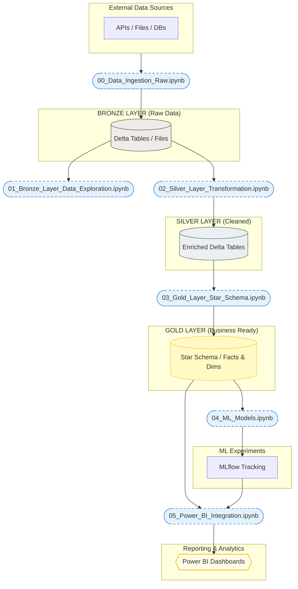
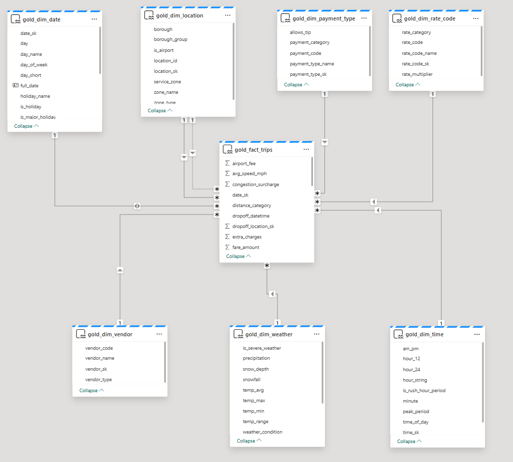

# 🚕 NYC Taxi Data Engineering - End-to-End Pipeline on Microsoft Fabric

[](https://www.microsoft.com/en-us/microsoft-fabric)
[](https://spark.apache.org/)
[](https://delta.io/)
[](https://mlflow.org/)
[](https://powerbi.microsoft.com/)

A production-grade **end-to-end data engineering project** built on **Microsoft Fabric**, demonstrating enterprise-level data pipeline architecture using the **Medallion Architecture** pattern. This project processes **190+ million NYC Yellow Taxi trip records** through a complete data lifecycle from ingestion to business intelligence.

---

## 📋 Table of Contents

- [Project Overview](#-project-overview)
- [Architecture](#-architecture)
- [Data Pipeline](#-data-pipeline)
- [Star Schema Design](#-star-schema-design)
- [Machine Learning Models](#-machine-learning-models)
- [Power BI Dashboards](#-power-bi-dashboards)
- [Technology Stack](#-technology-stack)
- [Getting Started](#-getting-started)
- [Project Structure](#-project-structure)
- [Key Features](#-key-features)
- [Results & Insights](#-results--insights)
- [Author](#-author)
- [License](#-license)

---

## 🎯 Project Overview

This project demonstrates a comprehensive data engineering solution that:

- **Ingests** real-world NYC Taxi data from NYC TLC (Taxi & Limousine Commission)
- **Processes** 190+ million records using PySpark on Microsoft Fabric
- **Transforms** raw data through Bronze → Silver → Gold medallion layers
- **Builds** a Star Schema optimized for analytical workloads
- **Trains** 3 Machine Learning models with MLflow experiment tracking
- **Delivers** interactive Power BI dashboards for business insights

### 📊 Data Scale

| Metric | Value |
|--------|-------|
| **Total Records** | 189,523,210 |
| **Time Range** | Jan 2021 - Nov 2025 |
| **Total Revenue** | $4.9 Billion |
| **Unique Zones** | 265 |
| **Weather Records** | 1,826 days |

---

## 🏗 Architecture

### High-Level Architecture

```mermaid
graph LR
    subgraph FabricWorkspace ["Microsoft Fabric Workspace"]
        direction LR
        
        %% External Sources
        subgraph External ["External Sources"]
            direction TB
            S1["• NYC TLC API"]
            S2["• Weather API"]
            S3["• Holiday Data"]
        end

        %% Bronze Layer
        subgraph Bronze ["Bronze Layer"]
            direction TB
            B1["• Raw Parquet"]
            B2["• CSV Files"]
            B3["• No Transform"]
        end

        %% Silver Layer
        subgraph Silver ["Silver Layer"]
            direction TB
            V1["• Cleaned Data"]
            V2["• Standardized"]
            V3["• Enriched"]
        end

        %% Gold Layer
        subgraph Gold ["Gold Layer"]
            direction TB
            G1["• Star Schema"]
            G2["• Fact Table"]
            G3["• Dimensions"]
        end

        %% ML and Reporting
        ML["ML MODELS<br/>(MLflow)"]
        PBI{{"POWER BI<br/>DASHBOARDS"}}

        %% Storage Foundation
        OneLake[("ONELAKE STORAGE<br/>(Delta Format)")]

        %% Flows
        External --> Bronze
        Bronze --> Silver
        Silver --> Gold
        Gold --> ML
        Gold --> PBI
        ML --> PBI
        
        %% Linking to OneLake (Implicitly supports all layers)
        Bronze -.-> OneLake
        Silver -.-> OneLake
        Gold -.-> OneLake
    end

    %% Styling
    style FabricWorkspace fill:#f9f9f9,stroke:#333,stroke-width:2px
    style OneLake fill:#e1f5fe,stroke:#01579b,stroke-width:2px
    style ML fill:#fff3e0,stroke:#ff6f00
    style PBI fill:#fffde7,stroke:#fbc02d
    style Bronze fill:#efebe9,stroke:#5d4037
    style Silver fill:#eceff1,stroke:#455a64
    style Gold fill:#fff9c4,stroke:#fbc02d
```



### Medallion Architecture

| Layer | Purpose | Storage Format | Tables |
|-------|---------|----------------|--------|
| **🥉 Bronze** | Raw data ingestion, schema validation | Parquet/CSV | Raw taxi trips, zones, weather, holidays |
| **🥈 Silver** | Data cleansing, standardization, enrichment | Delta Lake | Cleaned trips, enriched zones, calendar |
| **🥇 Gold** | Business-ready analytics, star schema | Delta Lake | Fact table + 7 dimensions |

---

## 🔄 Data Pipeline

### Notebook Execution Flow


### Data Sources

| Source | Description | Records | Format |
|--------|-------------|---------|--------|
| **NYC TLC** | Yellow Taxi Trip Data (2021-2025) | 189M+ | Parquet |
| **Taxi Zones** | NYC Geographic Zones | 265 | CSV |
| **Weather** | Daily NYC Weather Data | 1,826 | CSV |
| **US Holidays** | Federal Holiday Calendar | 75 | CSV |

---

## ⭐ Star Schema Design

The Gold layer implements a classic **Star Schema** optimized for Power BI analytics:



### Table Details

| Table | Type | Records | Key Columns |
|-------|------|---------|-------------|
| `gold_fact_trips` | Fact | 189M | fare_amount, trip_distance, tip_amount, surcharges |
| `gold_dim_date` | Dimension | 1,826 | date_sk, year, month, day_name, is_holiday |
| `gold_dim_time` | Dimension | 1,440 | time_sk, hour_24, am_pm, is_rush_hour |
| `gold_dim_location` | Dimension | 265 | location_sk, zone_name, borough, is_airport |
| `gold_dim_weather` | Dimension | 1,826 | weather_sk, temp_avg, precipitation, weather_condition |
| `gold_dim_vendor` | Dimension | 3 | vendor_sk, vendor_name, vendor_code |
| `gold_dim_payment_type` | Dimension | 7 | payment_type_sk, payment_type_name, allows_tip |
| `gold_dim_rate_code` | Dimension | 7 | rate_code_sk, rate_code_name, rate_multiplier |

---

## 🤖 Machine Learning Models

Three ML models are trained using **PySpark MLlib** with **MLflow** for experiment tracking and model versioning:

### Model Performance

| Model | Algorithm | Metric | Score |
|-------|-----------|--------|-------|
| **🚕 Fare Prediction** | GBT Regressor | RMSE | $5.45 |
| | | MAE | $3.00 |
| | | R² | 0.886 |
| **💰 Tip Classification** | Random Forest | AUC | 0.619 |
| | | Accuracy | 77.5% |
| | | F1 Score | 0.687 |
| **📈 Demand Forecasting** | GBT Regressor | RMSE | 36.42 |
| | | MAE | 24.78 |
| | | R² | 0.919 |

### MLflow Tracking

- **Experiment Name:** `NYC_Taxi_ML_Models`
- **Auto-versioning:** Models automatically increment version numbers
- **Artifact Storage:** `Files/ml_models/{model_name}/{version}/`
- **Model Registry:** `gold_ml_model_registry` table

---

## 📊 Power BI Dashboards

Interactive dashboards providing business insights across 6 analytical dimensions:

### 1. Executive Dashboard


Key metrics at a glance:
- **189.52M** Total Trips
- **$4.9B** Total Revenue  
- **$17.86** Average Fare
- **20.35%** Average Tip Percentage

### 2. Geographic Analysis


- Top 10 Pickup Zones
- Top Routes Table
- Airport vs Non-Airport Distribution
- Borough Comparison

### 3. Time Analysis


- Hourly Demand Pattern
- Day of Week Distribution
- Monthly Trend by Year
- Hour vs Day Heatmap

### 4. Weather Impact Analysis


- Trips by Weather Condition
- Temperature vs Trips Correlation
- Speed vs Weather Relationship
- Severe Weather Loss Estimation

### 5. Financial Performance


- Revenue YTD with YoY Growth
- Revenue Trend with Forecast
- Revenue by Payment Type
- Revenue per Mile Analysis

### 6. ML Model Performance


- Model Metrics Summary
- Actual vs Predicted Visualization
- Model Version History
- Experiment Tracking

---

## 🛠 Technology Stack

| Category | Technologies |
|----------|-------------|
| **Platform** | Microsoft Fabric, OneLake |
| **Processing** | Apache Spark, PySpark |
| **Storage** | Delta Lake, Parquet |
| **ML/AI** | PySpark MLlib, MLflow |
| **Visualization** | Power BI |
| **Languages** | Python, SQL, DAX |
| **Version Control** | Git, GitHub |

---

## 🚀 Getting Started

### Prerequisites

- Microsoft Fabric workspace with Lakehouse capacity
- Power BI Pro license (for publishing reports)
- Git (for cloning repository)

### Installation

1. **Clone the repository**
   ```bash
   git clone https://github.com/pqnghiep1354/nyc-taxi-fabric-pipeline.git
   cd nyc-taxi-fabric-pipeline
   ```

2. **Create Fabric Lakehouse**
   - Navigate to your Microsoft Fabric workspace
   - Create a new Lakehouse named `TaxiAnalytics_Lakehouse`

3. **Upload Notebooks**
   - Import all `.ipynb` files from the `notebooks/` directory
   - Attach notebooks to the Lakehouse

4. **Execute Pipeline**
   ```
   Run notebooks in order:
   00 → 01 → 02 → 03 → 04 → 05
   ```

5. **Create Power BI Report**
   - Follow instructions in `05_Power_BI_Integration.ipynb`
   - Create Semantic Model from Gold layer tables
   - Build dashboards using provided DAX measures

---

## 📁 Project Structure

```
nyc-taxi-fabric-pipeline/
│
├── 📓 notebooks/
│   ├── 00_Data_Ingestion_Raw.ipynb          # Data source ingestion
│   ├── 01_Bronze_Layer_Data_Exploration.ipynb  # Schema validation & exploration
│   ├── 02_Silver_Layer_Transformation.ipynb    # Data cleansing & enrichment
│   ├── 03_Gold_Layer_Star_Schema.ipynb         # Star schema creation
│   ├── 04_ML_Models.ipynb                      # ML training with MLflow
│   └── 05_Power_BI_Integration.ipynb           # BI layer setup
│
├── 📊 reports/
│   └── NYC_Taxi_Analytics.pbix               # Power BI report file
│
├── 📄 docs/
│   ├── images/                               # Dashboard screenshots
│   ├── NYC_TLC_Data_Dictionary.md            # Column definitions
│   └── DAX_Measures_Library.md               # DAX formula reference
│
├── 📜 README.md                              # This file
└── 📜 LICENSE                                # MIT License
```

---

## ✨ Key Features

### Data Engineering
- ✅ **Medallion Architecture** - Bronze/Silver/Gold layer separation
- ✅ **Schema Evolution** - Handling NYC TLC schema changes across years
- ✅ **Incremental Loading** - Support for new data additions
- ✅ **Data Quality Rules** - Comprehensive validation and cleansing
- ✅ **Delta Lake Optimization** - ACID transactions, time travel

### Machine Learning
- ✅ **MLflow Integration** - Experiment tracking and model registry
- ✅ **Auto-versioning** - Automatic model version management
- ✅ **Multiple Models** - Regression, classification, forecasting
- ✅ **Feature Engineering** - Time-based, weather, and geographic features

### Business Intelligence
- ✅ **Star Schema** - Optimized dimensional modeling
- ✅ **Pre-aggregated Tables** - Performance-optimized for Power BI
- ✅ **42 DAX Measures** - Complete measure library
- ✅ **6 Dashboard Pages** - Comprehensive analytical views
- ✅ **Forecasting** - Built-in trend analysis

---

## 📈 Results & Insights

### Key Business Insights

1. **Manhattan Dominance**: 88.39% of all trips originate in Manhattan
2. **Peak Hours**: Evening rush (5-7 PM) shows highest demand
3. **Weather Impact**: Rainy days reduce trip volume by 0.7%
4. **Payment Shift**: Credit card usage at 76.9% (vs 13.1% cash)
5. **Airport Traffic**: 7.4% of trips are airport-related

### Model Insights

- **Fare Prediction**: Distance and time of day are strongest predictors
- **Tip Classification**: Payment type and trip distance impact tip likelihood
- **Demand Forecasting**: Strong weekly seasonality patterns detected

---

## 👤 Author

**Phạm Quốc Nghiệp**
Last update: 2026-01-13

- 🔗 GitHub: [@phamquocnghiep](https://github.com/pqnghiep1354)
- 💼 LinkedIn: [Phạm Quốc Nghiệp](https://www.linkedin.com/in/nghiep-pham-b0a15956/)

---

## 📄 License

This project is licensed under the MIT License - see the [LICENSE](LICENSE) file for details.

---

## 🙏 Acknowledgments

- **NYC Taxi & Limousine Commission** - For providing open taxi trip data
- **Microsoft Fabric Team** - For the excellent data platform
- **Apache Spark Community** - For the powerful processing engine

---

<p align="center">
  
  
</p>

<p align="center">
  ⭐ Star this repository if you found it helpful!
</p>
